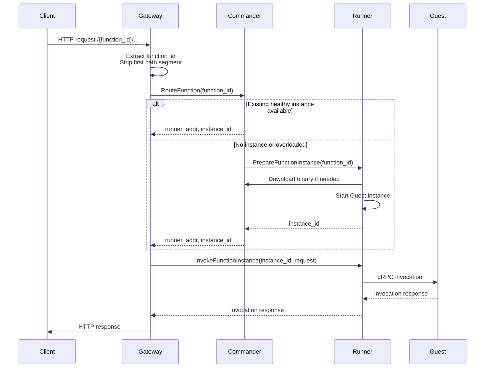

# Servermore

Servermore is a simplified serverless platform written in Go.

## DEV setup

This project uses [mise](https://mise.jdx.dev/getting-started.html) for tool management.
Install it and run `mise install`. You have everything you need for the project,
confirm it by running `mise test` which builds the project and runs tests.

## Overview

The system is split into four components:

- `Gateway`: public HTTP entrypoint
- `Commander`: control plane and scheduler
- `Runner`: execution node hosting function instances
- `Guest`: user function runtime exposed through an SDK and invoked over gRPC

## Tech Stack

- Go
- SQLite behind an interface generated with `sqlc`
- gRPC for internal communication
- HTTP for public ingress defined through OpenAPI
- `slog` for structured logging

## Request Flow

1. A client sends an HTTP request to `Gateway`.
2. The first path segment must be the `function_id`.
3. `Gateway` strips that `function_id` from the forwarded request path.
4. `Gateway` asks `Commander` where the request should go.
5. `Commander` routes the function request:
   - if an instance of a function is already running on some `Runner`, and is
     not overloaded, route to that `instance_id`.
   - if no instance is running, or is overloaded, `Commander` requests a
     `Runner` to prepare an instance for that function and routes to the new `instance_id`.
6. `Commander` returns to `Gateway` the runner address and the `instance_id`.
7. `Gateway` sends the invocation to that `Runner` with `instance_id`.
8. `Runner` forwards the invocation to the selected `Guest` over gRPC.
9. The response goes back through `Runner` and `Gateway` to the client.

## Responsibilities

### Gateway

- exposes the public HTTP API
- extracts `function_id` from the path
- normalizes incoming HTTP requests
- asks `Commander` to route each request
- invokes the selected `Runner`

### Commander

- stores functions, runners, and routing state
- receives runner registration and pulls runner heartbeats
- prepares new instances
- routes requests to a concrete `runner` + `instance_id`
- tracks load and queue depth
- avoids routing to unavailable runners
- provides a HTTP API for downloading function binaries

### Runner

- exposes a gRPC API
- prepares function instances on demand
- if needed, downloads function binaries
- starts and stops guest processes
- invokes guests over gRPC
- heartbeat with queue depth and resource utilization

### Guest

- is the user function process
- runs as a long-lived gRPC server
- receives normalized invocation requests
- returns invocation responses
- is started through the guest SDK
